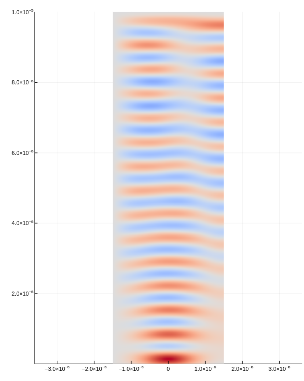

```@meta
CurrentModule = FieldDistributionNonuniformMedium
```

# FieldDistributionNonuniformMedium

Documentation for [FieldDistributionNonuniformMedium](https://github.com/foldfelis/FieldDistributionNonuniformMedium.jl).

## Installation

The package can be installed with the Julia package manager.
From the Julia REPL, type `]` to enter the Pkg REPL mode and run:

```julia-REPL
pkg> add https://github.com/foldfelis/FieldDistributionNonuniformMedium.jl
```

## Quick start

```julia-REPL
julia> using FieldDistributionNonuniformMedium

julia> s = Simulator();

julia> simulate!(s);

julia> plot_e_field(s)
```



## Index

```@index
```

## APIs

```@autodocs
Modules = [FieldDistributionNonuniformMedium]
```
