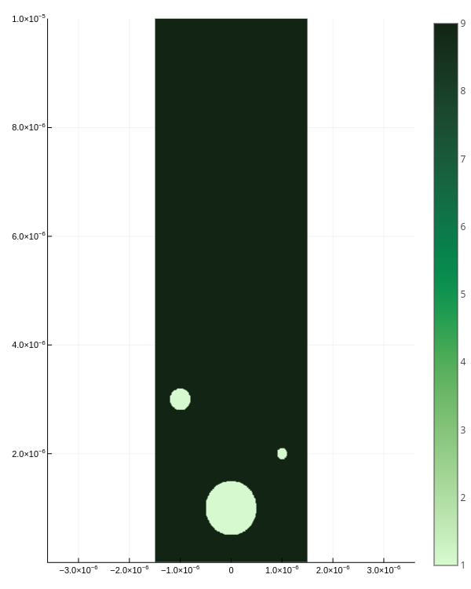
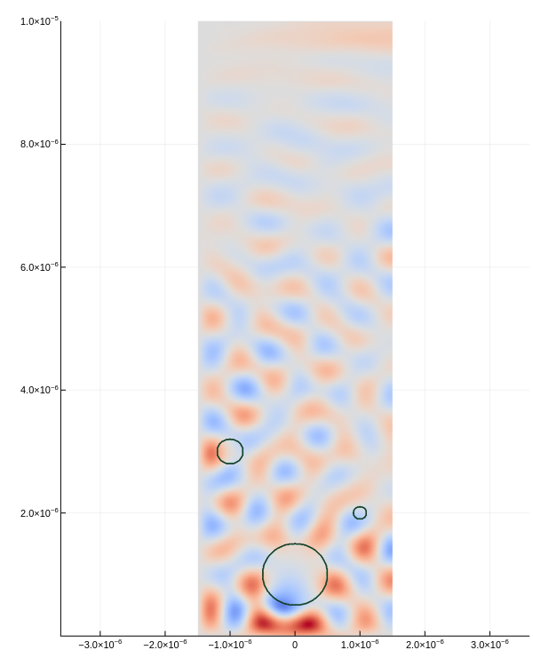

## Simulation

There are two way to construct a `Simulator` with **uniform** permittivity.

### Construct simulator by parameter

```julia
s = Simulator(
    max_x=3e-6, max_y=10e-6, max_t=0.1e-12, # calculation boundaries
    nx=300, ny=1000, # discretization
    λ=2.04e-6, # wavelength of light
    ϵ = 9., μ = 1. # permittivity and permeability
)
```

### Construct simulator by components

#### Declare constants

```julia
# calculation boundaries
max_x = 3e-6
max_y = 10e-6
max_t = 0.1e-12

# discretization
nx = 300
ny = 1000

# wavelength of light
λ = 2.04e-6

# permittivity and permeability
ϵ = 9.
μ = 1.
```

#### Construct components

```julia
grid = Grid(max_x, max_y, max_t, nx, ny)
light = Light(λ)
permittivity = Permittivity(ϵ, grid)
permeability = Permeability(μ, grid)
```

#### Construct simulator

```julia
s = Simulator(grid, light, permittivity, permeability)
```

## Implant defect to modify permittivity

```julia
# ##########
# # const. #
# ##########

# calculation boundaries
max_x = 3e-6
max_y = 10e-6
max_t = 0.1e-12

# discretization
nx = 300
ny = 1000

# wavelength of light
λ = 2.04e-6

# permittivity and permeability
ϵ = 9.
μ = 1.

# defect
ϵ_defect = 1.
xs_defect = [0, 1e-6, -1e-6]
ys_defect = [1e-6, 2e-6, 3e-6]
rs_defect = [0.5e-6, 0.1e-6, 0.2e-6]

# ##############
# # components #
# ##############

grid = Grid(max_x, max_y, max_t, nx, ny)
light = Light(λ)
permittivity = Permittivity(ϵ, grid)
permeability = Permeability(μ, grid)

implant!(permittivity, ϵ_defect, xs_defect, ys_defect, rs_defect, grid)

# #############
# # simulator #
# #############
s = Simulator(grid, light, permittivity, permeability)
```

Or

```julia
ϵ_defect = 1.
xs_defect = [0, 1e-6, -1e-6]
ys_defect = [1e-6, 2e-6, 3e-6]
rs_defect = [0.5e-6, 0.1e-6, 0.2e-6]

s = Simulator(
    max_x=3e-6, max_y=10e-6, max_t=0.1e-12, # calculation boundaries
    nx=300, ny=1000, # discretization
    λ=2.04e-6, # wavelength of light
    ϵ = 9., μ = 1. # permittivity and permeability
)

implant!(s.permittivity, ϵ_defect, xs_defect, ys_defect, rs_defect, s.grid)
```

## Run simulation

```julia
simulate!(s)
```

To see permittivity:

```julia
plot_ϵ(s)
```



To sea the result:

```julia
plot_e_field(s)
```


